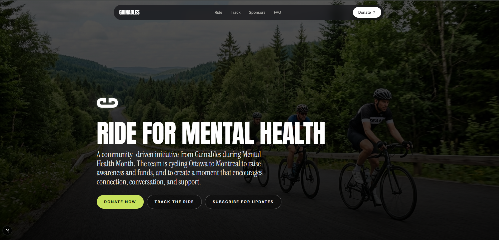
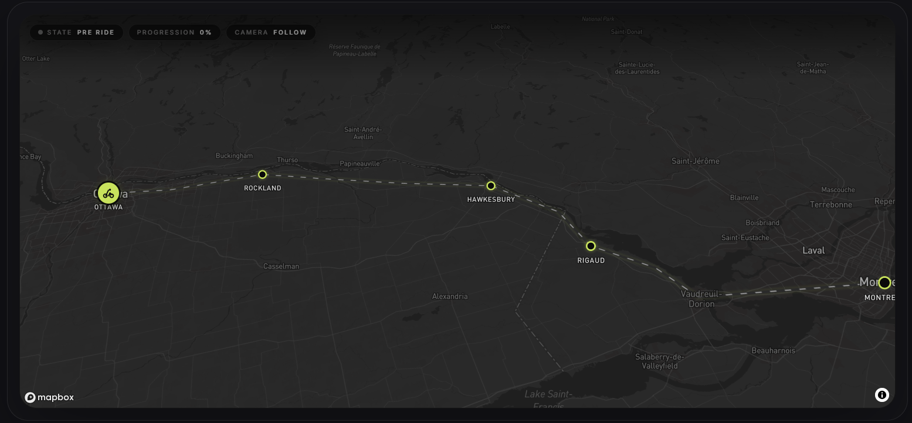
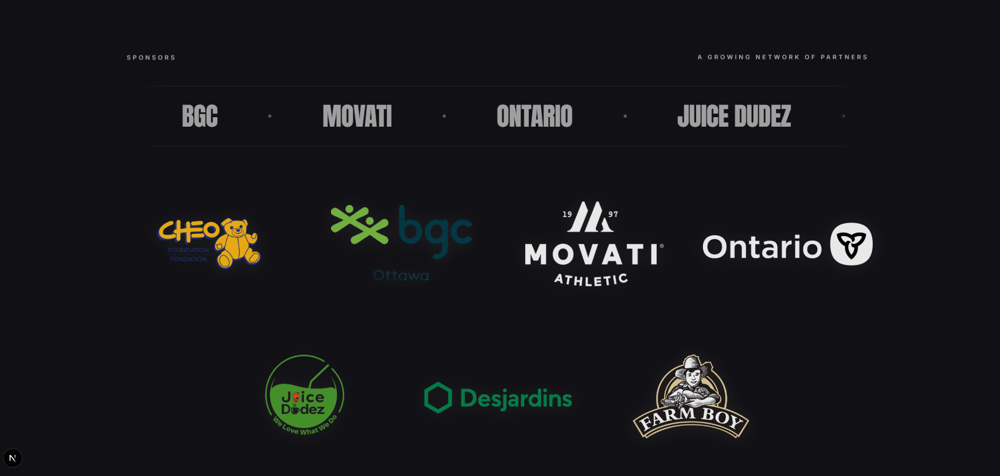
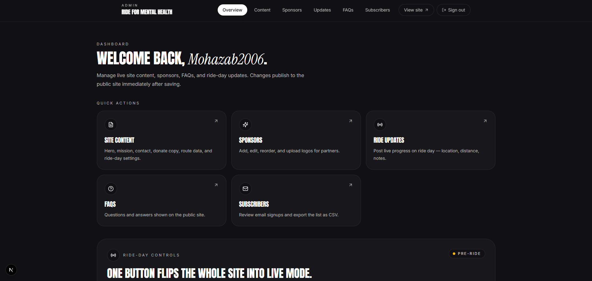

<div align="center">

# Ride for Mental Health

**Ottawa → Montréal. One ride. One cause.**

Next.js 16 campaign site for Gainables' Ottawa-to-Montréal Ride for Mental Health — with live GPS tracking, editable Supabase-backed content, and a sponsor-ready presence.

<!--
  HERO IMAGE
  Drop your hero screenshot at: docs/images/hero.png
  Recommended size: 1600×900 (or 2x for retina). PNG or WEBP.
-->


<br />

<p>
  <a href="#-quick-start"></a>
  
  
  
  
  
</p>

</div>

---

## Table of contents

- [Highlights](#-highlights)
- [Screenshots](#-screenshots)
- [Tech stack](#-tech-stack)
- [Quick start](#-quick-start)
- [Environment variables](#-environment-variables)
- [Database & Edge Functions](#-database--edge-functions)
- [Ride-day operations](#-ride-day-operations)
- [Useful commands](#-useful-commands)
- [Project structure](#-project-structure)

---

## Highlights

- **Live rider tracking** — Mapbox GL JS map fed by a Supabase Edge Function ingesting positions from Overland.
- **Editable content everywhere** — FAQs, ride updates, sponsors, and subscribers all live in Supabase.
- **Admin tooling** — email-allowlisted `/admin` area for managing content and exporting subscribers.
- **Email capture** — optional Resend integration for signup confirmations.
- **Modern UI** — Tailwind v4 + Radix primitives, animated with GSAP, accessible by default.

---

## Screenshots

> Add images to `docs/images/` and they will appear automatically.

<table>
<tr>
<td width="50%" align="center">
<b>Landing / Hero</b><br/><br/>
<!-- Place file at: docs/images/hero.png -->

</td>
<td width="50%" align="center">
<b>Live Tracker (Mapbox)</b><br/><br/>
<!-- Place file at: docs/images/tracker.png -->

</td>
</tr>
<tr>
<td width="50%" align="center">
<b>Sponsors</b><br/><br/>
<!-- Place file at: docs/images/sponsors.png -->

</td>
<td width="50%" align="center">
<b>Admin Dashboard</b><br/><br/>
<!-- Place file at: docs/images/admin.png -->

</td>
</tr>
</table>

<details>
<summary><b>Image drop-in checklist</b></summary>

| Slot            | Path                        | Recommended size | Notes                                    |
| --------------- | --------------------------- | ---------------- | ---------------------------------------- |
| Hero            | `docs/images/hero.png`      | 1600×900         | Used at the very top and in screenshots. |
| Tracker (map)   | `docs/images/tracker.png`   | 1600×900         | Screenshot of `/track` with the map.     |
| Sponsors        | `docs/images/sponsors.png`  | 1600×700         | Capture the sponsor grid/section.        |
| Admin dashboard | `docs/images/admin.png`     | 1600×900         | Screenshot of the `/admin` area.         |

Tip: PNG for crisp UI screenshots, WEBP if you want smaller files. Keep filenames lowercase.

</details>

---

## Tech stack

| Layer          | Choice                                                           |
| -------------- | ---------------------------------------------------------------- |
| Framework      | **Next.js 16.2** (App Router) + **React 19**                     |
| Styling        | **Tailwind CSS v4**, Radix UI primitives, `tailwind-merge`, GSAP |
| Data           | **Supabase** (Postgres, Auth, Realtime, SSR helpers)             |
| Maps           | **Mapbox GL JS**                                                 |
| GPS ingestion  | **Supabase Edge Function** (`ingest-position`) + Overland        |
| Email (opt-in) | **Resend**                                                       |
| Analytics      | **Vercel Analytics**                                             |

---

## Quick start

```bash
# 1. Install dependencies
pnpm install

# 2. Configure environment
cp .env.example .env.local
#    then fill in the values below

# 3. Run the app
pnpm dev
```

Then open [http://localhost:3000](http://localhost:3000).

### First-run checklist

1. Copy `.env.example` → `.env.local`.
2. Fill in the Supabase URL, publishable key, and service-role key.
3. Set `ADMIN_ALLOWED_EMAILS` to the comma-separated admin allowlist.
4. Add `NEXT_PUBLIC_MAPBOX_TOKEN` for the branded live map on `/track` (otherwise a fallback tracker panel is shown).
5. Set `RIDER_TOKEN` before generating the Overland setup link for the lead rider.
6. Optional: add `RESEND_API_KEY` and `RESEND_FROM_EMAIL` to send signup confirmation emails.

---

## Environment variables

| Variable                              | Required | Purpose                                                           |
| ------------------------------------- | :------: | ----------------------------------------------------------------- |
| `NEXT_PUBLIC_SITE_URL`                | ✅       | Canonical site URL used by metadata and auth callbacks.           |
| `NEXT_PUBLIC_SUPABASE_URL`            | ✅       | Supabase project URL.                                             |
| `NEXT_PUBLIC_SUPABASE_PUBLISHABLE_KEY`| ✅       | Browser-safe key for public reads and Realtime.                   |
| `SUPABASE_SERVICE_ROLE_KEY`           | ✅       | Server-only key for admin writes and Edge Function ingestion.     |
| `NEXT_PUBLIC_MAPBOX_TOKEN`            | ✅       | Public Mapbox token for the `/track` map.                         |
| `ADMIN_ALLOWED_EMAILS`                | ✅       | Comma-separated allowlist for `/admin` access.                    |
| `RIDER_TOKEN`                         | ✅       | Bearer token validated by `supabase/functions/ingest-position`.   |
| `RESEND_API_KEY`                      |    –     | Optional API key for signup confirmation emails.                  |
| `RESEND_FROM_EMAIL`                   |    –     | Optional sender. Defaults to `onboarding@resend.dev`.             |

---

## Database & Edge Functions

Run the initial schema:

```bash
# Applies tables, policies, and indexes for content, sponsors, FAQs,
# subscribers, ride updates, and rider positions.
psql "$SUPABASE_DB_URL" -f supabase/migrations/0001_init.sql
```

Deploy the GPS ingest function:

```bash
supabase functions deploy ingest-position
```

Set its secrets:

```bash
supabase secrets set \
  SUPABASE_URL=... \
  SUPABASE_SERVICE_ROLE_KEY=... \
  RIDER_TOKEN=...
```

See [`supabase/migrations/0001_init.sql`](./supabase/migrations/0001_init.sql) for the full schema.

---

## Ride-day operations

- **Overland setup & rider link format** → [`docs/overland-setup.md`](./docs/overland-setup.md)
- **Deployment & support workflow** → [`docs/ride-day-runbook.md`](./docs/ride-day-runbook.md)
- **Subscriber export & follow-up** → visit `/admin/subscribers`

---

## Useful commands

```bash
pnpm dev                  # start the dev server
pnpm build                # production build
pnpm start                # run the production build
pnpm lint                 # eslint
pnpm exec tsc --noEmit    # type-check the project
```

---

## Project structure

```
.
├─ app/                       # Next.js App Router routes (public + /admin + /track)
├─ components/                # UI + feature components (Radix + Tailwind)
├─ lib/                       # Supabase clients, helpers, domain logic
├─ public/                    # Static assets (logos, favicons, hero bg)
├─ supabase/
│  ├─ migrations/0001_init.sql
│  └─ functions/ingest-position/
├─ docs/
│  ├─ images/                 # ← Put README screenshots here
│  ├─ overland-setup.md
│  └─ ride-day-runbook.md
└─ README.md
```

---

<div align="center">

Built with care for <b>Gainables</b> · Ottawa → Montréal

</div>
